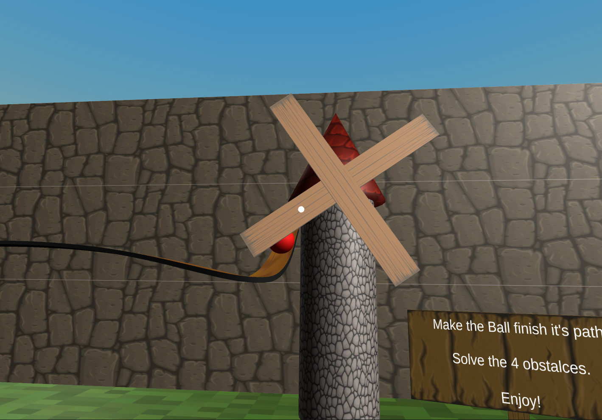
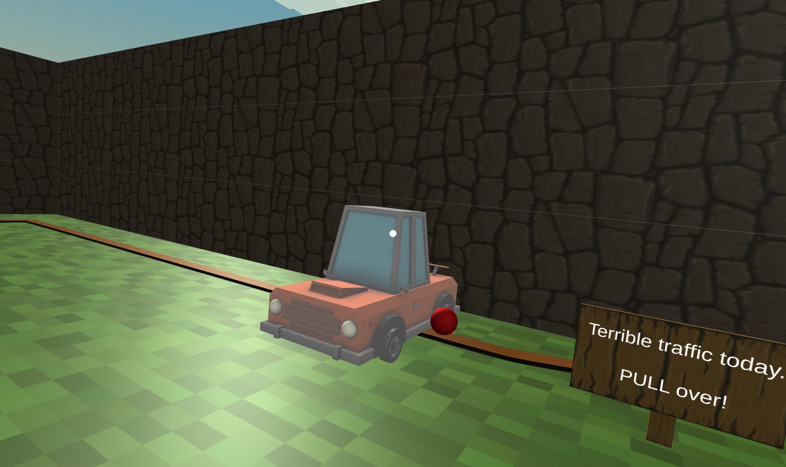

  <h3 align="center">Google Cardboard VR Puzzle Game</h3>

  

    A VR puzzle game for Android.
  

  
   

  

    
    
  

## 📋 <a name="table">Table of Contents</a>
1. 🤖 [Introduction](#introduction)
2. ⚙️ [How to run](#how-to-run)
3. 🚀 [Features](#features)

## <a name="introduction">🤖 Introduction</a>

Developed using the Unity game engine, along with Google Cardboard, and built for Android as part of the Virtual and Augmented Reality (VAR) course. This project's goal is to get some hands-on experience on Virtual Reality (VR) techniques and development guidelines.

## <a name="how-to-run">⚙️ How to run</a>

**Prerequisites**

Make sure you have the following installed on your machine:
- [Unity](https://unity.com/) (Version: 2021.3.31f1)
- Android 13 (API Level 32)
- Simple bluetooth controller

## <a name="features">🚀 Features</a>

**Objective**

Sole a 4-step puzzle mini-game by handling interactions with the environment (gaze tracking).

**Mechanics**

- Respecting the available hardware and trying to minimize the computational costs, the main protagonist (a ball) uses a C# pathing system, instead of handling physics (e.g. collisions).
- Navigate through the environment by teleporting to fixed locations. These locations are visible, but inactive until gazed at. When gazed, an animating arrow indicates the possibility to teleport there.
- Interactable objects are highlighted (when available - previous puzzles should be solved) when gazing at them.
- Mesh creation to handle the second obstacle.

Highlighted Obstacle 1   |  Highlighted Obstacle 3
:-------------------------:|:-------------------------:
  |  

**Controls**

- Gaze at interactable objects.
- "Top" trigger button: Teleport to the indicated Navigation Mark.
- "Bottom" trigger button: Interact with the environment's objects to solve the puzzles.

**Notes/Bugs**

- Interactable object highlighting was working in the built VR version, but suddenly stop working at some point, without making any changes to that. Its proper functioning can be tested in the Unity Editor if the Camera Pointer looks at the object that you have to interact with.

Demo Gameplay|
:-------------------------:|
|